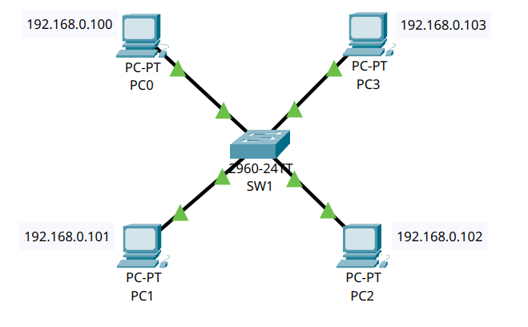

# 🌐 Esercizio 01: Rete LAN base con Switch
## 🎯 Obiettivo:

Creare una rete LAN semplice composta da 4 dispositivi collegati tramite uno Switch.
Lo scopo dell'esercizio è: 
- Configurare gli indirizzi IP dei dispositivi
- Verificare la comunicazione nella rete
- Utilizzare il comando 'ping' per il test

## 🖥️ Topologia di rete

Schema della Rete realizzata:



## 🧰 Dispositivi utilizzati
|  Dispositivo  |  Quantità  |
|--|--|
| Cisco Catalyst 2960 | 1 |
| PC | 4 |
| Cavi Copper Straight-Through | 4 |

## 📡Configurazione IP
| Dispositivo | Indirizzo IP | Subnet Mask |  
|---|---|---|  
| 💻 PC0 | 192.168.0.100 | 255.255.255.0 |  
| 💻 PC1 | 192.168.0.101 | 255.255.255.0 |  
| 💻 PC2 | 192.168.0.102 | 255.255.255.0 |
| 💻 PC3 | 192.168.0.103 | 255.255.255.0 |

## ⚙️ Configurazione Eseguita

###  💻 Computer

Configurati Manualmente:

- Indirizzo IP
- Subnet Mask

### 🔀 Switch

Lo switch opera in modalità Layer 2 con configurazione di default (VLAN 1)
E' stato cambiato solo l'hostname tramite i comandi:

```
conf t
hostname SW1

```


## 🛠️ Test Effettuati

Verifica dell'effettivo collegamento dei PC allo Switch tramite il comando:

```
show interfaces status
```
con seguente Output:
```
Port Name Status     Vlan  Duplex   Speed   Type
Fa0/1     connected  1     a-full   a-100   10/100BaseTX
Fa0/2     connected  1     a-full   a-100   10/100BaseTX
Fa0/3     connected  1     a-full   a-100   10/100BaseTX
Fa0/4     connected  1     a-full   a-100   10/100BaseTX
Fa0/5     notconnect 1     auto     auto    10/100BaseTX
Fa0/6     notconnect 1     auto     auto    10/100BaseTX
Fa0/7     notconnect 1     auto     auto    10/100BaseTX
Fa0/8     notconnect 1     auto     auto    10/100BaseTX
```
Verifica della Switching Table dello Switch utilizzando il comando:

```
show mac address-table
```
con seguente Output:

```
Mac Address Table
-------------------------------------------
Vlan Mac Address    Type     Ports
---- -----------    -------- -----
1    0001.42e2.119a DYNAMIC  Fa0/2
1    0007.ec04.8b32 DYNAMIC  Fa0/3
1    0009.7ccd.653b DYNAMIC  Fa0/1
1    000b.be8d.1d85 DYNAMIC  Fa0/4
```

Verifica della comunicazione tramite ping:  

✔ Test di connettività: tutti i ping riusciti tra i PC

❓ **Come funziona una Rete LAN?**

Una rete LAN (Local Area Network) è una rete composta da dispositivi situati all'interno di un'area geografica limitata, come un'abitazione, un ufficio o un laboratorio. I dispositivi possono comunicare tra loro attraverso collegamenti fisici, come i cavi Ethernet, oppure tramite collegamenti wireless. Nella rete realizzata in questo esercizio, la comunicazione avviene mediante uno switch, un dispositivo di rete che riceve i frame Ethernet e li inoltra verso il dispositivo destinatario.
Affinché i dispositivi possano comunicare direttamente tra loro, devono appartenere alla stessa sottorete (subnet). Se il destinatario appartiene a una rete diversa, è necessario un gateway, generalmente rappresentato da un router, che ha il compito di instradare i pacchetti tra reti differenti.
Lo switch opera al livello 2 (Data Link) del modello ISO/OSI e prende le proprie decisioni di inoltro in base agli indirizzi MAC. Per farlo utilizza una tabella chiamata MAC Address Table (o Switching Table), che viene popolata automaticamente durante la fase di Address Learning, associando ogni indirizzo MAC alla porta da cui è stato appreso. 
Quando uno switch riceve un frame, registra immediatamente l'indirizzo MAC sorgente associandolo alla porta di ingresso. Successivamente verifica se conosce l'indirizzo MAC del destinatario. Se questo non è presente nella MAC Address Table, lo switch esegue il flooding, inoltrando il frame su tutte le porte eccetto quella di ingresso. Quando il dispositivo destinatario risponde, lo switch apprende anche il suo indirizzo MAC, completando così il popolamento della tabella.
Quando un PC deve comunicare con un altro dispositivo nella stessa rete, invia una richiesta ARP in broadcast per ottenere l'indirizzo MAC associato all'IP di destinazione. Il dispositivo che possiede quell'IP risponde con il proprio MAC Address, permettendo così la comunicazione a livello Ethernet.

❗ **Precisazioni:**

**MAC Address:** il MAC Address (Media Access Control) è un indirizzo fisico di 48-bit espresso in formato esadecimale che identifica univocamente ogni scheda di rete. È composto da due parti: i primi 24 bit identificano il produttore (OUI, Organisationally Unique Identifier), mentre i restanti 24 bit identificano univocamente la scheda di rete (Network Interface Controller - NIC).

**Indirizzo IP:** l'indirizzo IP è un indirizzo logico di 32-bit che identifica univocamente un dispositivo in una rete LAN o in una rete globale. diversamente dal MAC, l'IP può variare in base a diverse situazioni.

**ARP**: Il protocollo ARP (Address Resolution Protocol) permette di tradurre un indirizzo IP in un indirizzo MAC all'interno di una rete locale. Questo perché nella comunicazione a livello LAN i dati vengono scambiati utilizzando indirizzi MAC e quando un dispositivo conosce solo l'indirizzo IP del destinatario, deve prima scoprire il relativo MAC prima di poter inviare dati.

Si può trovare la ARP Table (o cache ARP) tramite il comando:

```
arp -a
```

con seguente Output:

```
C:\>arp -a
  Internet Address      Physical Address      Type
  192.168.0.101         0001.42e2.119a        dynamic
  192.168.0.102         000b.be8d.1d85        dynamic
  192.168.0.103         0007.ec04.8b32        dynamic
```

📌 Conclusione: All’interno di una LAN, la comunicazione tra dispositivi avviene grazie alla combinazione di indirizzi IP, utilizzati per identificare il destinatario logico, e indirizzi MAC, utilizzati per la consegna fisica dei frame. Il protocollo ARP e lo switch permettono di collegare questi due livelli e rendere possibile la comunicazione.


📌 Risultato:  
Tutti i dispositivi comunicano correttamente all'interno della rete. La rete LAN funziona correttamente in configurazione flat con subnet 192.168.0.0/24. Tutti i nodi comunicano tramite switching Layer 2 senza necessità routing. 


# 🛠️ Problemi riscontrati

Nessun problema rilevato.


