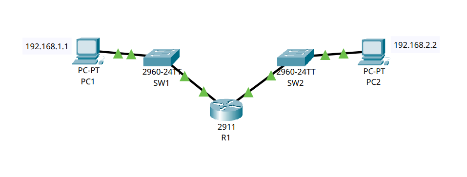

# 🌐 Esercizio 02: Due Reti Un Router
## 🎯 Obiettivo:

Creare due reti LAN semplici collegate tramite Router,  ciascuna composta da 1 dispositivo finale collegato tramite uno Switch.
Lo scopo dell'esercizio è: 
- Configurare gli indirizzi IP dei dispositivi
- Configurare le interfacce del Router
- Verificare la comunicazione nella rete
- Utilizzare il comando 'ping' per il test

## 🖥️ Topologia di rete

Schema della Rete realizzata:



## 🧰 Dispositivi utilizzati
|  Dispositivo  |  Quantità  |
|--|--|
| Cisco Catalyst 2960 | 2 |
| Cisco Router 2911 | 1 |
| PC | 2 |
| Cavi Copper Straight-Through | 4 |

## 📡Configurazione IP
| Dispositivo | Indirizzo IP | Subnet Mask | Gateway |
|---|---|---|---| 
| 💻 PC1 | 192.168.1.1 | 255.255.255.0 | 192.168.1.254 |
| 💻 PC2 | 192.168.2.1 | 255.255.255.0 | 192.168.2.254 |

## ⚙️ Configurazione Eseguita

###  💻 Computer

Configurati Manualmente:

- Indirizzo IP
- Subnet Mask
- Gateway

### 🔀 Switch

Nessuna configurazione è stata apportata.

### 🖧 Router

Configurazione delle due interfacce Gig0/0 e Gig0/1 tramite i seguenti comandi:
```
conf t
int Gig0/0
ip address 192.168.1.254 255.255.255.0
no shutdown
exit 

conf t
int Gig0/1
ip address 192.168.2.254 255.255.255.0
no shutdown
exit

write
```

## 🛠️ Test Effettuati

Verifica dell'effettivo collegamento dei PC agli Switch tramite il comando:

```
show interfaces status
```
con seguente Output:
```
SW1
Port    Name  Status     Vlan   Duplex    Speed   Type
Fa0/1         connected  1      a-full    a-100   10/100BaseTX
Gig0/1        connected  1      a-full    a-100   10/100/1000BaseTX

SW2
Port    Name  Status     Vlan   Duplex    Speed   Type
Fa0/1         connected  1      a-full    a-100   10/100BaseTX
Gig0/1        connected  1      a-full    a-100   10/100/1000BaseTX
```
Verifica della Switching Table dello Switch utilizzando il comando:

```
show mac address-table
```
con seguente Output:

```
SW1
Mac Address Table
-------------------------------------------
Vlan Mac Address    Type     Ports
---- -----------    -------- -----
1    00d0.ff60.6702 DYNAMIC  Gig0/1

SW2
Mac Address Table
-------------------------------------------
Vlan Mac Address    Type     Ports
---- -----------    -------- -----
1    00d0.ff60.6701 DYNAMIC  Gig0/1
```
Verifica della Configurazione del Router tramite il comando:
```
show ip interface brief
```
con seguente Output:

```
Interface            IP-Address      OK?   Method   Status   Protocol
GigabitEthernet0/0   192.168.2.254   YES   manual   up       up
GigabitEthernet0/1   192.168.1.254   YES   manual   up       up
```


Verifica della comunicazione tramite ping:  

✔ Test di connettività: tutti i ping riusciti tra i PC

❓ Come comunicano due reti LAN differenti?

Una rete LAN permette la comunicazione diretta solo tra dispositivi appartenenti alla stessa sottorete (subnet).
Quando un client, deve comunicare con un dispositivo che non appartiene alla sua stessa sottorete, lo switch (che opera al livello 2) non è più sufficiente ed è necessario implementare un dispositivo di livello 3 chiamato **router** che ha il compito di instradare i pacchetti tra reti diverse.
In questo esercizio sono state realizzare due reti LAN:

|  Rete  |  Network ID  |
|--|--|
| LAN 1 | 192.168.1.0/24 |
| LAN 2 | 192.168.2.0/24 |

Poiché i due PC appartengono a due sottoreti differenti, non possono comunicare direttamente tra loro. Ogni computer, utilizza quindi il Default Gateway, rappresentato dall'indirizzo IP dell'interfaccia del router appartenente alla propria rete.

❓ Cos'è il Default Gateway?

Il Default Gateway rappresenta il punto di uscita della rete locale. Quando un dispositivo deve inviare un pacchetto verso una destinazione che non appartiene alla proprio sottorete, inoltra il traffico al gateway, lasciano al router il compito di individuare il percorso corretto.
In questo caso:

|  PC  |  Gateway  |
|--|--|
| PC1 | 192.168.1.254 |
| PC2 | 192.168.2.254 |

❓ Come funziona il Router?

Il router opera al livello 3 (Network) del modello ISO/OSI e prende le proprie decisioni analizzando gli indirizzi IP dei pacchetti ricevuti.

Ogni volta che riceve un pacchetto:

1. Legge l'indirizzo IP di destinazione;
2. consulta la **Routing Table**;
3. individua l'interfaccia corretta;
4. inoltra il pacchetto verso la rete di destinazione

Nel caso di questo esercizio il router possiede due interfacce, ciascuna appartenente a una rete differente:

|  Interfaccia  |  Rete  |
|--|--|
| Gig0/0 | 192.168.1.0/24 |
| Gig0/1 | 192.168.2.0/24 |

Questo gli permette di inoltrare i pacchetti tra le due LAN.

📦 Esempio di comunicazione

Quando il PC1 invia un ping verso PC2, avvengono le seguenti operazioni:

1. PC1 verifica che l'indirizzo IP di destinazione non appartenza alla propria sottorete.
2. Il pacchetto viene inviato al Default Gateway.
3. Il router riceve il pacchetto sulla porta Gig0/0
4. Consulta la propria Routing Table
5. Individua la rete 192.1680.2.0/24 come direttamente connessa.
6. Inoltra il pacchetto attraverso l'interfaccia Gig0/1
7. PC2 riceve il pacchetto e risponde seguendo lo stesso percorso in senso inverso.

E' possibile visualizzare la Routing Table tramite il seguente comando:

```
show ip route
```

con seguente Output:

```
     192.168.1.0/24 is variably subnetted, 2 subnets, 2 masks
C       192.168.1.0/24 is directly connected, GigabitEthernet0/1
L       192.168.1.254/32 is directly connected, GigabitEthernet0/1
     192.168.2.0/24 is variably subnetted, 2 subnets, 2 masks
C       192.168.2.0/24 is directly connected, GigabitEthernet0/0
L       192.168.2.254/32 is directly connected, GigabitEthernet0/0
```
Dove **C** sta per Connected e identifica la sottorete direttamente collegata a quell'interfaccia.
**L** invece, identifica l'esatto indirizzo IP assegnato a quell'interfaccia.

📌 Conclusione:

In questo esercizio è stato possibile osservare come il router renda possibile la comunicazione tra reti differenti. Mentre gli switch si limitano a inoltrare i frame all'interno della stessa LAN utilizzando gli indirizzi MAC, il router analizza gli indirizzi IP e utilizza la Routing Table per instradare i pacchetti verso la rete di destinazione.

📌 Risultato:  
Tutti i dispositivi comunicano correttamente all'interno della rete. Le due LAN comunicano correttamente tramite routing a livello 3 effettuato dal router.


# 🛠️ Problemi riscontrati

Nessun problema rilevato.


