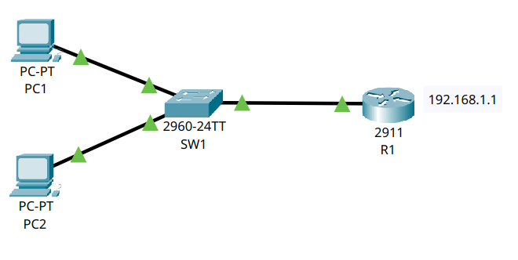

# 🌐 Esercizio 03: DHCP server su router
## 🎯 Obiettivo:

Impostare un Router con funzione di DHCP server
Lo scopo dell'esercizio è: 
- Configurare gli indirizzi IP dei dispositivi
- Configurare l'interfaccia del Router
- Configurare il servizio DHCP
- Verificare la comunicazione nella rete
- Utilizzare il comando 'ping' per il test

## 🖥️ Topologia di rete

Schema della Rete realizzata:



## 🧰 Dispositivi utilizzati
|  Dispositivo  |  Quantità  |
|--|--|
| Cisco Catalyst 2960 | 1 |
| Cisco Router 2911 | 1 |
| PC | 2 |
| Cavi Copper Straight-Through | 3 |

## 📡Configurazione IP
| Dispositivo | Indirizzo IP | Subnet Mask | Gateway | DNS Server |
|---|---|---|---| --- |
| 💻 PC1 | 192.168.1.11 | 255.255.255.0 | 192.168.1.1 | 8.8.8.8 |
| 💻 PC2 | 192.168.1.12 | 255.255.255.0 | 192.168.1.1 | 8.8.8.8 |

Gli indirizzi IP riportati sono stati assegnati automaticamente dal servizio DHCP configurato sul router.

## ⚙️ Configurazione Eseguita

###  💻 Computer

Indirizzi configurati tramite DCHP Server

### 🔀 Switch

Lo switch opera in modalità Layer 2 con configurazione di default (VLAN 1)

### 🖧 Router

Configurazione del interfaccia Gig0/0 tramite i seguenti comandi:
```
conf t
int Gig0/0
ip address 192.168.1.1 255.255.255.0
no shutdown
exit 
```
Configurazione del Servizio DHCP tramite i seguenti comandi:

```
conf t
ip dhcp pool RETE-LAN
network 192.168.1.0 255.255.255.0
default-router 192.168.1.1
dns-server 8.8.8.8
exit
ip dhcp excluded-address 192.168.1.1 192.168.1.10
write
```


## 🛠️ Test Effettuati

Verifica dell'effettivo collegamento dei PC agli Switch tramite il comando:

```
show interfaces status
```
con seguente Output:
```
SW1
Port    Name  Status     Vlan   Duplex    Speed   Type
Fa0/1         connected  1      a-full    a-100   10/100BaseTX
Fa0/2         connected  1      a-full    a-100   10/100BaseTX
Gig0/1        connected  1      a-full    a-100   10/100/1000BaseTX

```
Verifica della Switching Table dello Switch utilizzando il comando:

```
show mac address-table
```
con seguente Output:

```
SW1
Mac Address Table
-------------------------------------------
Vlan Mac Address    Type     Ports
---- -----------    -------- -----
1    00d0.ff60.6702 DYNAMIC  Gig0/1
```
Verifica della Configurazione del Router tramite il comando:
```
show ip interface brief
```
con seguente Output:

```
Interface            IP-Address      OK?   Method   Status   Protocol
GigabitEthernet0/0   192.168.1.1   YES   manual   up       up
```
Verifica del Pool del DHCP tramite il comando:
```
show ip dhcp pool
```
con seguente Output:

```
Pool RETE-LAN :
Utilization mark (high/low) : 100 / 0
Subnet size (first/next) : 0 / 0
Total addresses : 254
Leased addresses : 2
Excluded addresses : 1
Pending event : none

1 subnet is currently in the pool
Current index     IP address range              Leased/Excluded/Total
192.168.1.1       192.168.1.1 - 192.168.1.254   2     / 1      / 254
```
Verifica degli indirizzi IP assegnati dal DHCP tramite il comando:
```
show ip dhcp binding
```
con seguente Output:
```
IP address     Client-ID/             Lease expiration   Type
               Hardware address
192.168.1.11   00E0.B0DA.289E         --                 Automatic
192.168.1.12   0001.9729.C77B         --                 Automatic
```

Verifica della comunicazione tramite ping:  

✔ Test di connettività: tutti i ping riusciti tra i PC

❓ Com'è il servizio DHCP? 

Il DHCP (Dynamic Host Configuration Protocol) è un protocollo applicativo (ausiliario) che permette ai dispositivi di una rete locale di ricevere automaticamente ad ogni richiesta di accesso, la configurazione IP necessaria alla comunicazione evitando la configurazione manuale di ogni host.
Il protocollo è spesso implementato tramite **server** oppure tramite **router**.
Esistono due possibili configurazioni:

- DHCP Stateful: il server assegna tradizionalmente gli indirizzi IP ai dispositivi
- DHCP Stateless: i dispositivi sono in grado di generarsi autonomamente gli indirizzi IP tramite la procedura SLAAC. Il server DHCP server a condividere parametri secondari come i DNS.

❓ Come funziona il DHCP?

**DORA** è il processo che permette al client di ricevere la configurazione IP dal server DHCP:

PC                     Router (DHCP Server)

DHCP Discover  ---------------------------->

                 <---------------------- DHCP Offer

DHCP Request   ---------------------------->

                 <------------------------ DHCP ACK


1. DHCP Discover

Il client non possiede ancora un indirizzo IP, dunque manda un messaggio broadcast con sorgente 0.0.0.0 e destinazione 255.255.255.255, con l'obbiettivo di cercare un server DHCP disponibile nella rete.

2. DHCP Offer

il server risponde proponendo un indirizzo IP disponibile insieme agli altri parametri di configurazione (Subnet Mask, Default Gateway).

3. DHCP Request

il client comunica di voler accettare proprio quell'offerta
In questo modo si evita problemi in caso ci siano più server DHCP.

4. DHCP Ack

il server conferma definitivamente l'assegnazione dell'indirizzo.

❓ Cos'è il Lease Time?

Il Lease Time è il tempo in cui è valido quell'indirizzo IP. Questo perché l'IP assegnato non appartiene definitivamente al client, ma viene concesso per un determinato intervallo di tempo. Alla scadeva il client richiede il rinnovo della concessione.

E' possibile visualizzare informazioni importati sul DHCP tramite il comando:

```
ipconfig /all
```

con seguente Output:

```
FastEthernet0 Connection:(default port)

   Connection-specific DNS Suffix..: 
   Physical Address................: 00E0.B0DA.289E
   Link-local IPv6 Address.........: FE80::2E0:B0FF:FEDA:289E
   IPv6 Address....................: ::
   IPv4 Address....................: 192.168.1.11
   Subnet Mask.....................: 255.255.255.0
   Default Gateway.................: ::
                                     192.168.1.1
   DHCP Servers....................: 192.168.1.1
   DHCPv6 IAID.....................: 
   DHCPv6 Client DUID..............: 00-01-00-01-EE-9A-D4-59-00-E0-B0-DA-28-9E
   DNS Servers.....................: ::
                                     8.8.8.8
```
📌 Conclusione:

Il protocollo DHCP semplifica notevolmente la gestione delle reti, consentendo ai dispositivi di ottenere automaticamente la configurazione necessaria alla comunicazione. In questo esercizio il router ha svolto sia la funzione di gateway sia quella di server DHCP, assegnando dinamicamente gli indirizzi IP ai client mediante il processo DORA.

📌 Risultato:  
Tutti i dispositivi comunicano correttamente all’interno della stessa rete IP tramite switching Layer 2 e gateway unico sul router.


# 🛠️ Problemi riscontrati

Nessun problema rilevato.


