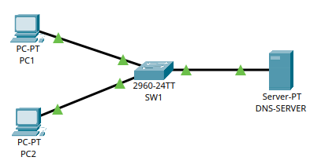

# 🌐 Esercizio 04: DNS Server
## 🎯 Obiettivo:

Impostare un Server con funzione DNS
Lo scopo dell'esercizio è: 
- Configurare gli indirizzi IP dei dispositivi
- Configurare il servizio DNS
- Verificare la comunicazione nella rete
- Utilizzare il comando 'ping' per il test

## 🖥️ Topologia di rete

Schema della Rete realizzata:



## 🧰 Dispositivi utilizzati
|  Dispositivo  |  Quantità  |
|--|--|
| Cisco Catalyst 2960 | 1 |
| Cisco Server-PT | 1 |
| PC | 2 |
| Cavi Copper Straight-Through | 3 |

## 📡Configurazione IP
| Dispositivo | Indirizzo IP | Subnet Mask |  DNS Server |
|---|---|---|---|
| 💻 PC1 | 192.168.0.11 | 255.255.255.0 | 192.168.0.100 |
| 💻 PC2 | 192.168.0.12 | 255.255.255.0 | 192.168.0.100 |
| 🌐 DNS-SERVER | 192.168.0.100 | 255.255.255.0 |Vuoto

## ⚙️ Configurazione Eseguita

###  💻 Computer

Configurati manualmente:

- Indirizzo IP
- Subnet Mask
- DNS Server

### 🔀 Switch

Lo switch opera in modalità Layer 2 con configurazione di default (VLAN 1)

###  🌐 Server

Assegnati l'indirizzo IP e la subnet mask.
Abilitato il servizio DNS e aggiunto Record:

| No. | Name | Type | Detail
|--|--|--|--| 
| 0 | www.lucamarengo.com | A | 192.168.0.100 |
| 1 | www.lucamarengo.it  | A | 192.168.0.100 | 
| 2 | www.lucamarengo.org | A | 192.168.0.100 | 

## 🛠️ Test Effettuati

Verifica dell'effettivo collegamento dei PC allo Switch tramite il comando:

```
show interfaces status
```
con seguente Output:
```
SW1
Port    Name  Status     Vlan   Duplex    Speed   Type
Fa0/1         connected  1      a-full    a-100   10/100BaseTX
Fa0/2         connected  1      a-full    a-100   10/100BaseTX
Fa0/3         connected  1      a-full    a-100   10/100BaseTX
```
Verifica della Switching Table dello Switch utilizzando il comando:

```
show mac address-table
```
con seguente Output:

```
SW1
Mac Address Table
-------------------------------------------
Vlan Mac Address    Type     Ports
---- -----------    -------- -----
1    0060.4703.1753 DYNAMIC  Fa0/1
1    0090.2116.1355 DYNAMIC  Fa0/2
1    00e0.a3d6.5107 DYNAMIC  Fa0/3
```
Verifica del corretto funzionamento del DNS Server tramite il comando ping:
```
C:\>ping www.lucamarengo.it

Pinging 192.168.0.100 with 32 bytes of data:
Reply from 192.168.0.100: bytes=32 time<1ms TTL=128
Reply from 192.168.0.100: bytes=32 time<1ms TTL=128
Reply from 192.168.0.100: bytes=32 time=5ms TTL=128
Reply from 192.168.0.100: bytes=32 time<1ms TTL=128

Ping statistics for 192.168.0.100:
Packets: Sent = 4, Received = 4, Lost = 0 (0% loss),
Approximate round trip times in milli-seconds:
Minimum = 0ms, Maximum = 5ms, Average = 1ms
```
Stesso risultato per .com e .org
Il comando ping ha verificato la corretta risoluzione del nome DNS tramite il server configurato e successivamente la connettività verso l'indirizzo IP ottenuto.

📌 Risultato:
Tutti i dispositivi comunicano correttamente all’interno della stessa rete IP tramite switching Layer 2, il server DNS funziona correttamente e risponde alle richieste dei dispositivi.


# 🛠️ Problemi riscontrati

Nessun problema rilevato.


