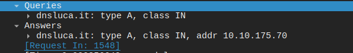

# 🌐 Esercizio 04: DNS Server
## 🎯 Obiettivo:

Impostare un Server con funzione DNS
Lo scopo dell'esercizio è: 
- Configurare gli indirizzi IP dei dispositivi
- Configurare il servizio DNS
- Verificare la comunicazione nella rete
- Utilizzare il comando 'ping' per il test

## 🖥️ Topologia di rete

Schema della Rete realizzata:


## 🧰 Dispositivi utilizzati
|  Dispositivo  |  Quantità  |
|--|--|
| Cisco Catalyst 2960 | 1 |
| Cisco Server-PT | 1 |
| PC | 2 |
| Cavi Copper Straight-Through | 3 |

## 📡Configurazione IP
| Dispositivo | Indirizzo IP | Subnet Mask |  DNS Server |
|---|---|---|---|
| 💻 PC1 | 192.168.0.11 | 255.255.255.0 | 192.168.0.100 |
| 💻 PC2 | 192.168.0.12 | 255.255.255.0 | 192.168.0.100 |
| 🌐 DNS-SERVER | 192.168.0.100 | 255.255.255.0 |Vuoto

## ⚙️ Configurazione Eseguita

###  💻 Computer

Configurati manualmente:

- Indirizzo IP
- Subnet Mask
- DNS Server

### 🔀 Switch

Lo switch opera in modalità Layer 2 con configurazione di default (VLAN 1)

###  🌐 Server

Assegnati l'indirizzo IP e la subnet mask.
Abilitato il servizio DNS e aggiunto Record:

| No. | Name | Type | Detail
|--|--|--|--| 
| 0 | www.lucamarengo.com | A | 192.168.0.100 |
| 1 | www.lucamarengo.it  | A | 192.168.0.100 | 
| 2 | www.lucamarengo.org | A | 192.168.0.100 | 

## 🛠️ Test Effettuati

Verifica dell'effettivo collegamento dei PC allo Switch tramite il comando:

```
show interfaces status
```
con seguente Output:
```
SW1
Port    Name  Status     Vlan   Duplex    Speed   Type
Fa0/1         connected  1      a-full    a-100   10/100BaseTX
Fa0/2         connected  1      a-full    a-100   10/100BaseTX
Fa0/3         connected  1      a-full    a-100   10/100BaseTX
```
Verifica della Switching Table dello Switch utilizzando il comando:

```
show mac address-table
```
con seguente Output:

```
SW1
Mac Address Table
-------------------------------------------
Vlan Mac Address    Type     Ports
---- -----------    -------- -----
1    0060.4703.1753 DYNAMIC  Fa0/1
1    0090.2116.1355 DYNAMIC  Fa0/2
1    00e0.a3d6.5107 DYNAMIC  Fa0/3
```
Verifica del corretto funzionamento del DNS Server tramite il comando ping:
```
C:\>ping www.lucamarengo.it

Pinging 192.168.0.100 with 32 bytes of data:
Reply from 192.168.0.100: bytes=32 time<1ms TTL=128
Reply from 192.168.0.100: bytes=32 time<1ms TTL=128
Reply from 192.168.0.100: bytes=32 time=5ms TTL=128
Reply from 192.168.0.100: bytes=32 time<1ms TTL=128

Ping statistics for 192.168.0.100:
Packets: Sent = 4, Received = 4, Lost = 0 (0% loss),
Approximate round trip times in milli-seconds:
Minimum = 0ms, Maximum = 5ms, Average = 1ms
```
Stesso risultato per .com e .org
Il comando ping ha verificato la corretta risoluzione del nome DNS tramite il server configurato e successivamente la connettività verso l'indirizzo IP ottenuto.

❓ Cos'è il DNS?

Il DNS (Domain Name System) è un protocollo applicativo che permette di tradurre un nome di dominio nel corrispondente indirizzo IP utilizzato dai dispositivi di rete. Grazie al DNS non è necessario ricordare gli indirizzi IP numerici dei server, ma è sufficiente utilizzare nomi facilmente memorizzabili.

❓ Come funziona il DNS?

Client
 │
 │ 1. DNS Query (richiesta)
 ▼
Server DNS
 │
 │ 2. DNS Response
 ▼
PC
 │
 │ 3. Connessione verso l'indirizzo IP ottenuto
 ▼
Server

1. Inserimento del nome

Il client inserisce un nome di dominio, ad esempio:

**www.lucamarengo.it**

2. Richiesta DNS

Il client invia una richiesta al server DNS configurato nella propria scheda di rete, chiedendo quale indirizzo IP corrisponda al nome richiesto.

3. Risposta DNS

Il server consulta il proprio database e restituisce l'indirizzo IP associato.
Ad esempio: www.lucamarengo.it --> 192.168.0.100

4. Comunicazione

Solo dopo aver ottenuto l'indirizzo IP, il client può iniziare la comunicazione con il server.

❓ Perché il DNS è così importante?

I protocolli di rete, come IP, utilizzano esclusivamente indirizzi numerici. Il DNS rappresenta un sistema di traduzione che permette agli utenti di utilizzare nomi facilmente memorizzabili invece di indirizzi IP.
Senza il DNS sarebbe necessario conoscere l'indirizzo IP di ogni server con cui si desidera comunicare.

❓ Cosa sono le DNS Query?

Le DNS Query sono delle richieste inviate da un client a un server con lo scopo di tradurre un nome di dominio in un indirizzo IP.Questo processo prende il nome di DNS Lookup o Risoluzione DNS.

Il DNS Lookup funziona in questo modo:

1. Il client invia una richiesta DNS contenente il nome di dominio
2. Il server DNS ricerca il record nel proprio database
3. Se il record è presente, restituisce l'indirizzo IP al client
4. Il client utilizza l'IP ricevuto per avviare la comunicazione con il server

❓ Cos'è un Record A?

In questo esercizio vengono affrontati i Record A (Address Record). I Record A sono record DNS utilizzati per associare i nomi di un dominio a indirizzi IPv4.

---

📌 Analisi dei pacchetti con Wireshark

Per osservare il funzionamento del protocollo DNS è stata effettuata una cattura del traffico di rete utilizzando Wireshark durante la risoluzione del nome dominio di test **dnsluca.it**. L'analisi mostra le diverse fasi della comunicazione tra client e server DNS, evidenziando come un nome dominio venga tradotto nel corrispondente indirizzo IP prima dell'avvio della comunicazione.
Dalla cattura è possibile osservare che il protocollo DNS utilizza, in questo caso, il protocollo di trasporto **UDP sulla porta 53**, utilizzata per le normali richieste e risposte DNS.


1. DNS Standard Query (IPv4)

Il client invia una DNS Standard Query al server DNS (pacchetto n. 1548) contenente il nome di dominio da risolvere di tipo A (IPv4):
```
Standard query 0xd8fc A dnsluca.it
```
2. DNS Standard Query (IPv6)

Parallelamente, il client invia una DNS Standard Query al server DNS (pacchetto n. 1551) contenente il nome di dominio da risolvere di tipo AAAA (IPv6)
```
Standard query 0xd602 AAAA dnsluca.it
```

3. Risposta alla Query IPv6

Il server restituisce  al client (pacchetto n.1552) un record "SOA Localhost" (Start of Authority):
Indica che è stata applicata un meccanismo standard chiamato **Negavite Caching**. Il server, afferma che lui è l'autorità massima per la zona **dnsluca.it** e conferma che il dominio esiste ma che il record AAAA non esiste.
Questo meccanismo, permette al client di memorizzare temporaneamente l'assenza del record ed evitare richieste ripetute.
Il server DNS deve comunque restituire una risposta al client, anche in assenza del record richiesto, evitando che il client attenda il timeout della richiesta.
Invece "locahost" spunta fuori perché nella configurazione del DNS, il SOA è stato associato a localhost.

4. Risposta alla Query IPv4

Il server, risponde al client (pacchetto n. 1553) con l'indirizzo IP.
Analizzando il pacchetto infatti, è possibile vedere:



- Queries: la richiesta effettuata dal client
- Answers: la risposta del server per il client.

📌 Risultato:
Il server DNS risponde correttamente alle richieste dei client traducendo i nomi di dominio nei corrispondenti indirizzi IP. L'analisi con Wireshark ha inoltre permesso di osservare il funzionamento delle DNS Query e delle relative risposte, evidenziando il ruolo del protocollo DNS nella fase preliminare della comunicazione tra dispositivi.

# 🛠️ Problemi riscontrati

Nessun problema rilevato.


