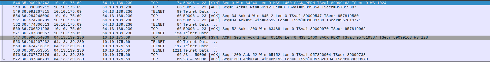
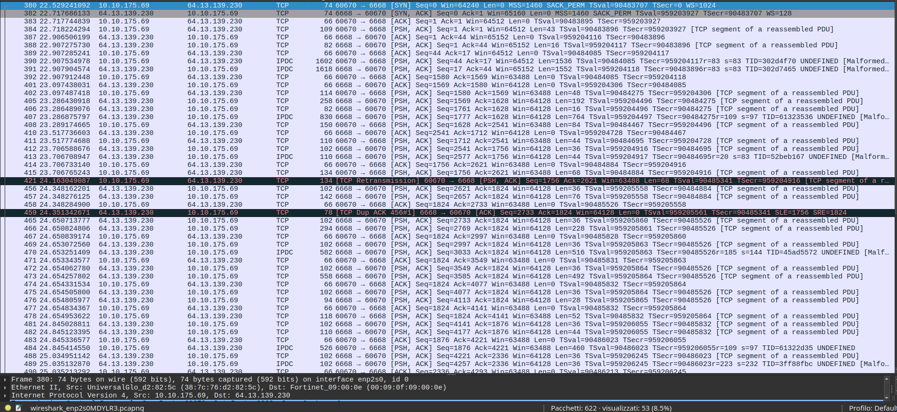

# 🌐 Esercizio 05: Telnet vs SSH
## 🎯 Obiettivo:

Impostare un Router accessibile tramite Telnet o SSH
Lo scopo dell'esercizio è: 
- Configurare gli indirizzi IP dei dispositivi
- Configurare il servizio Telnet e SSH
- Verificare l'accessibilità tramite Telnet e SSH

## 🖥️ Topologia di rete

Schema della Rete realizzata:


## 🧰 Dispositivi utilizzati
|  Dispositivo  |  Quantità  |
|--|--|
| Cisco Catalyst 2911 | 1 |
| Cisco 2960-24TT | 1 |
| PC | 1 |
| Cavi Copper Straight-Through | 2 |

## 📡Configurazione IP
| Dispositivo | Indirizzo IP | Subnet Mask |  Default Gateway |
|---|---|---|---|
| 💻 PC1 | 192.168.1.10 | 255.255.255.0 | 192.168.1.1 |

## ⚙️ Configurazione Eseguita

###  💻 Computer

Configurati manualmente:

- Indirizzo IP
- Subnet Mask
- Default Gateway

### 🔀 Switch

Lo switch opera in modalità Layer 2 con configurazione di default (VLAN 1)

### 🖧 Router

Configurazione  dell'interfaccia Gig0/0 tramite i seguenti comandi:

```
conf t
hostname R1
int Gig0/0
ip address 192.168.1.1 255.255.255.0
no shutdown
```
Configurazione della connessione Telnet tramite i seguenti comandi:

```
line vty 0 4
password securepassword123
login
transport input telnet
exit
```
Spiegazione comandi:
```
line vty 0 4 --> abilita 5 sessioni remote (da 0 a 4)
password securepassword123 --> imposta la password per il collegamento tramite telnet
login --> obbliga a richiedere la password
transport input telnet --> permette l'accesso tramite telnet
```
Configurazione della connessione SSH tramite i seguenti comandi:

```
ip domain-name test.local
username admin secret securepassword123
crypto key generate rsa (1024)
line vty 0 4
transport input ssh
login local
ip ssh version 2
```

Spiegazione comandi:

```
ip domain-name test.local --> definisce il nome del dominio per i device
username admin secret securepassword123 --> crea utente admin e gli assegna la password
crypto key generate rsa --> SSH utilizza la coppia di chiavi RSA, il comando permette di generare delle chiavi RSA di dimensione a nostra scelta per identificare il server e per lo scambio iniziale
transport input ssh --> permette l'accesso tramite SSH
login local --> obbliga gli utenti ad autenticarsi tramite un utente e una password configurati un database locale
ip ssh version 2 --> abilita solo le connessioni con SSHv2 ed esclude quelle con obsolete con SSHv1

```

## 🛠️ Test Effettuati

Verifica dell'effettivo collegamento del PC allo Switch tramite il comando:

```
show interfaces status
```
con seguente Output:
```
SW1
Port    Name  Status     Vlan   Duplex    Speed   Type
Fa0/1         connected  1      a-full    a-100   10/100BaseTX
Gig0/1        connected  1      a-full    a-100   10/100/1000BaseTX
```
Verifica della Switching Table dello Switch utilizzando il comando:

```
show mac address-table
```
con seguente Output:

```
SW1
Mac Address Table
-------------------------------------------
Vlan Mac Address    Type     Ports
---- -----------    -------- -----
1    00d0.bca9.8c01 DYNAMIC  Gig0/1
```
Verifica del funzionamento delle connessioni Telnet e SSH tramite i comandi:

```
TELNET
C:\>telnet 192.168.1.1
Trying 192.168.1.1 ...Open
User Access Verification
Password:
R1>
```
```
SSH
R1>ssh -l admin 192.168.1.1
Password:
R1>
```

📌 Risultato:  
Il PC1 si collega al router utilizzando sia il protocollo Telnet sia il protocollo SSH.

# 🛠️ Problemi riscontrati

Purtroppo, tramite Cisco Packet Tracer non è possibile vedere il contenuto dei pacchetti per capire la differenza tra i due protocolli.
**TELNET**
Ho dunque utilizzato WireShark connettendomi a: **telehack.com (64.13.139.230)** 
Avviene una prima fase composta dal TCP Three-Way Handshake:
- **Pacchetto n. 544 corrisponde al [SYN] da parte del client**
- **Pacchetto n. 547 corrisponde al [SYN, ACK] da parte del server**
- **Pacchetto n. 548 corrisponde al [ACK] da parte del client**

Avviene poi una fase di negoziazione delle Opzioni Telnet, in cui vengono scambiati pacchetti di controllo Telnet (ES. Pacchetto n. 549 e 553)
Infine avviene la terza fase, in cui viene trasmesso il Payload, dunque i dati in chiaro: nel Pacchetto n. 568, viene visualizzato nel blocco **telnet data** il codice ASCII che compone il menù di benvenuto del server.



📌 Conclusione 1:  
Il protocollo Telnet risulta essere vulnerabile da Sniffing compromettendo la riservatezza della comunicazione in quanto non esiste una sicurezza.

**SSH**

Collegandomi a: **telehack.com (64.13.139.230)** tramite il comando:
```
ssh guest@telehack.com -p 6668
```
Riconosciamo già alcune differenze:

- E' necessario specificare un nome utente per poter accedere (questo  utente avrà dei permessi e delle restrizioni)
- E' necessario specificare una porta utilizzando il comando **-p** questo perché è possibile tenere la porta di default (22). La porta predefinita è la 22, ma può essere modificata per ridurre i tentativi di scansione automatica, pur non rappresentando una vera misura di sicurezza.

----------

Avviene una prima fase composta dal Handshake SSH che applica lo stesso identico meccanismo del Telnet (Questo perché entrambi sfruttano il protocollo TCP):

- **Pacchetto n. 380 corrisponde al [SYN] da parte del client**
- **Pacchetto n. 382 corrisponde al [SYN, ACK] da parte del server**
- **Pacchetto n. 383 corrisponde al [ACK] da parte del client**



Successivamente avviene la fase dello scambio dei dati: in questa fase, Wireshark etichetta i pacchetti con **[TCP segment of a reassembled PDU]**. Questo perché la sessione SSH si sta scambiando le chiavi crittografiche e i pacchetti di cifratura iniziali.
Inoltre possiamo notare che avviene un **[TCP Retransmission]**, dove il server risponde con un ACK e il client ritrasmette il pacchetto perso.
Successivamente avviene un buco nella ricezione dei dati.

📌 Conclusione 2: 
Il protocollo SSH risulta essere molto più sicuro rispetto al Telnet, applicando varie regole della sicurezza.
Il protocollo SSH funziona attraverso una fase iniziale in chiaro, dove avviene la Negoziazione dell'Algoritmo subito dopo il Three-Way Handshake e si mettono negoziano su quale algoritmo di crittografia utilizzare. Successivamente, avviene lo scambio delle chiavi tramite l'algoritmo Diffie-Hellman, dove il client e il server riescono a calcolare e generare indipendentemente la stessa identica chiave segreta  senza condividere informazioni nella rete (Detta **chiave simmetrica**). Da questo punto in poi, il traffico diventa cifrato. Nel terzo passaggio avviene l'autenticazione del server, dove il client salva la chiave pubblica del server, con lo scopo di evitare il Man-in-the-Middle. Nel quarto passaggio, avviene l'autenticazione del Client dove viene richiesta la password dell'utente specificato.
Come ultimo passaggio avviene l'apertura del canale, dove vengono trasmessi i dati dell'applicazione attraverso un canale cifrato, decifrati e mostrati a schermo.

| Caratteristica | Telnet | SSH |
|--|--|--|
| Porta | 23 | 22 |
| Protocollo | TCP | TCP |
| Cifratura | No | Si |
| Autenticazione | Password in chiaro | Password o Chiavi |
| Sicurezza | Bassa | Elevata |
| Utilizzo Moderno | Quasi mai | Standard |

