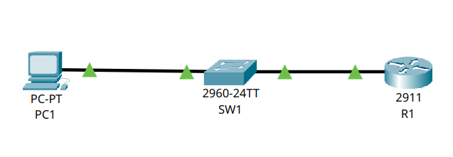

# 🌐 Esercizio 05: Telnet vs SSH
## 🎯 Obiettivo:

Impostare un Router accessibile tramite Telnet o SSH
Lo scopo dell'esercizio è: 
- Configurare gli indirizzi IP dei dispositivi
- Configurare il servizio Telnet e SSH
- Verificare l'accessibilità tramite Telnet e SSH

## 🖥️ Topologia di rete

Schema della Rete realizzata:



## 🧰 Dispositivi utilizzati
|  Dispositivo  |  Quantità  |
|--|--|
| Cisco Catalyst 2960 | 1 |
| Cisco 2960-24TT | 1 |
| PC | 1 |
| Cavi Copper Straight-Through | 2 |

## 📡Configurazione IP
| Dispositivo | Indirizzo IP | Subnet Mask |  Default Gateway |
|---|---|---|---|
| 💻 PC1 | 192.168.1.10 | 255.255.255.0 | 192.168.1.10 |

## ⚙️ Configurazione Eseguita

###  💻 Computer

Configurati manualmente:

- Indirizzo IP
- Subnet Mask
- Default Gateway

### 🔀 Switch

Lo switch opera in modalità Layer 2 con configurazione di default (VLAN 1)

### 🖧 Router

Configurazione  dell'interfaccia Gig0/0 tramite i seguenti comandi:

```
conf t
int Gig0/0
ip address 192.168.1.10 255.255.255.0
no shutdown
```
Configurazione della connessione Telnet tramite i seguenti comandi:

```
line vty 0 4
password securepassword123
login
transport input telnet
exit
```
Spiegazione comandi:
```
line vty 0 4 --> **abilita 5 sessioni remote (da 0 a 4)**
password securepassword123 --> **imposta la password per il collegamento tramite telnet**
login --> **obbliga a richiedere la password**
transport input telnet --> **permette l'accesso tramite telnet**
```
Configurazione della connessione SSH tramite i seguenti comandi:

```
ip domain-name test.local
username admin secret securepassword123
crypto key generate rsa **(1024)**
line vty 0 4
transport input ssh
login local
ip ssh version 2
```

Spiegazione comandi:

```
ip domain-name test.local --> **definisce il nome del dominio per i device**
username admin secret securepassword123 --> **crea utente admin e gli assegna la password**
crypto key generate rsa --> **SSH funziona tramite chiavi RSA, il comando permette di generare delle chiavi RSA di dimensione a nostra scelta**
transport input ssh --> **permette l'accesso tramite SSH**
login local --> **obbliga gli utenti ad autenticarsi tramite un utente e una password configurati un database locale**
ip ssh version 2 --> **abilita solo le connessioni con SSHv2 ed esclude quelle con obsolete con SSHv1**

```

## 🛠️ Test Effettuati

Verifica dell'effettivo collegamento dei PC allo Switch tramite il comando:

```
show interfaces status
```
con seguente Output:
```
SW1
Port    Name  Status     Vlan   Duplex    Speed   Type
Fa0/1         connected  1      a-full    a-100   10/100BaseTX
Gig0/1        connected  1      a-full    a-100   10/100/1000BaseTX
```
Verifica della Switching Table dello Switch utilizzando il comando:

```
show mac address-table
```
con seguente Output:

```
SW1
Mac Address Table
-------------------------------------------
Vlan Mac Address    Type     Ports
---- -----------    -------- -----
1    00d0.bca9.8c01 DYNAMIC  Gig0/1
```
Verifica del funzionamento delle connessioni Telnet e SSH tramite i comandi:

```
**TELNET**
C:\>telnet 192.168.1.1
Trying 192.168.1.1 ...Open
User Access Verification
Password:
R1>
```
```
**SSH**
R1>ssh -l admin 192.168.1.1
Password:
R1>
```

📌 Risultato:  
Il PC1 si collega al router utilizzando sia il protocollo Telnet sia il protocollo SSH.

# 🛠️ Problemi riscontrati

Purtroppo, tramite Cisco Packet Tracer non è possibile vedere il contenuto dei pacchetti per capire la differenza tra i due protocolli.
Ho dunque utilizzato WhireShark connettendomi a: 