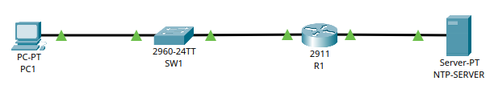

# 🌐 Esercizio 06: NTP Server
## 🎯 Obiettivo:

Impostare il servizio NTP su un server
Lo scopo dell'esercizio è: 
- Configurare gli indirizzi IP dei dispositivi
- Configurare il servizio NTP
- Verificare l'orario dei diversi dispositivi nella rete

## 🖥️ Topologia di rete

Schema della Rete realizzata:



## 🧰 Dispositivi utilizzati
|  Dispositivo  |  Quantità  |
|--|--|
| Cisco Router 2911 | 1 |
| Cisco Catalyst 2960-24TT | 1 |
| PC | 1 |
| Server-PT | 1 |
| Cavi Copper Straight-Through | 3 |

## 📡Configurazione IP
| Dispositivo | Indirizzo IP | Subnet Mask |  Default Gateway |
|---|---|---|---|
| 💻 PC1 | 192.168.0.11 | 255.255.255.0 | 192.168.0.254 |
| 🔀 SW1 | 192.168.0.2 | 255.255.255.0 | 192.168.0.254 |
| 🌐 SERVER | 192.168.1.100 | 255.255.255.0 | 192.168.1.254 |

## ⚙️ Configurazione Eseguita

###  💻 Computer

Configurati manualmente:

- Indirizzo IP
- Subnet Mask
- Default Gateway

### 🔀 Switch

Lo switch opera in modalità Layer 2 con configurazione di default (VLAN 1)
E' stato modificato l'hostname con il seguente comando:
```
hostname SW1
```
È stata configurata l'interfaccia virtuale VLAN 1 (SVI) per poter comunicare con il server NTP, questo è necessario affinché lo switch possa generare traffico IP ed effettuare richieste NTP verso il server. Senza un indirizzo IP sulla SVI, lo switch opererebbe esclusivamente a livello 2 e non potrebbe generare traffico IP verso altri dispositivi della rete.
La configurazione è stata effettuata tramite questo comando:
```
int vlan1
ip address 192.168.0.2 255.255.255.0
no shutdown
exit
ip default-gateway 192.168.0.254
ntp server 192.168.1.100
```
Questo perché lo switch diventa un client di rete che richiede l'orario al server.
Solitamente, non si usa mai la vlan1 come default, ma si crea una vlan dedicata per motivi di sicurezza.


### 🖧 Router

Configurazione  dell'interfaccia Gig0/0 tramite i seguenti comandi:

```
conf t
hostname R1
int Gig0/0
ip address 192.168.0.254 255.255.255.0
no shutdown
```

```
int Gig0/1
ip address 192.168.1.254 255.255.255.0
no shutdown
exit
ntp server 192.168.1.100
```

Tramite il comando ntp server viene configurato il server NTP di riferimento, con il quale il router sincronizzerà periodicamente il proprio orologio.

## 🛠️ Test Effettuati

Verifica dell'effettivo collegamento dei PC allo Switch tramite il comando:

```
show interfaces status
```
con seguente Output:
```
SW1
Port    Name  Status     Vlan   Duplex    Speed   Type
Fa0/1         connected  1      a-full    a-100   10/100BaseTX
Gig0/1        connected  1      a-full    a-100   10/100/1000BaseTX
```

Verifica della Switching Table dello Switch utilizzando il comando:

```
show mac address-table
```
con seguente Output:

```
SW1
Mac Address Table
-------------------------------------------
Vlan Mac Address    Type     Ports
---- -----------    -------- -----
1    0001.64a9.6301 DYNAMIC  Gig0/1
```

Verifica degli indirizzi IP assegnati alle porte del router tramite il comando:
```
show ip interface brief
```

con seguente Output:

```
Interface              IP-Address      OK? Method Status                Protocol 
GigabitEthernet0/0     192.168.0.254   YES manual up                    up 
GigabitEthernet0/1     192.168.1.254   YES manual up                    up 
```

Verifica della sincronizzazione dell'orologio dei dispositivi di rete tramite il comando:
```
show ntp status --> verifica lo stato di sincronizzazione
show ntp associations --> mostra i server NTP configurati e indica quale viene utilizzato come sorgente di sincronizzazione.
```

con seguente Output:

```
SW1 (show ntp status)

Clock is synchronized, stratum 2, reference is 192.168.1.100
nominal freq is 250.0000 Hz, actual freq is 249.9990 Hz, precision is 2**24
reference time is FFFFFFFFEDCD9F34.00000298 (19:17:8.664 UTC Tue Jul 7 2026)
clock offset is 1.00 msec, root delay is 3.00  msec
root dispersion is 55.36 msec, peer dispersion is 0.12 msec.
loopfilter state is 'CTRL' (Normal Controlled Loop), drift is - 0.000001193 s/s system poll interval is 4, last update was 10 sec ago.

SW1 (show ntp associations)

address         ref clock       st   when     poll    reach  delay          offset            disp
*~192.168.1.100 127.127.1.1     1    124      16      200    0.00           0.00              0.12
 * sys.peer, # selected, + candidate, - outlyer, x falseticker, ~ configured
```
```
R1 (show ntp status)

Clock is synchronized, stratum 2, reference is 192.168.1.100
nominal freq is 250.0000 Hz, actual freq is 249.9990 Hz, precision is 2**24
reference time is FFFFFFFFEDCD9FF5.000000A1 (19:20:21.161 UTC Tue Jul 7 2026)
clock offset is 0.00 msec, root delay is 0.00  msec
root dispersion is 57.52 msec, peer dispersion is 0.36 msec.
loopfilter state is 'CTRL' (Normal Controlled Loop), drift is - 0.000001193 s/s system poll interval is 4, last update was 7 sec ago.

R1 (show ntp associations)

address         ref clock       st   when     poll    reach  delay          offset            disp
*~192.168.1.100 127.127.1.1     1    76       16      20     0.00           0.00              0.12
 * sys.peer, # selected, + candidate, - outlyer, x falseticker, ~ configured
```

📌 Risultato:
Lo switch e il router si sincronizzano correttamente con il server NTP configurato. Entrambi risultano sincronizzati (Stratum 2) e utilizzano il server 192.168.1.100 come riferimento temporale. La corretta sincronizzazione garantisce che tutti i dispositivi della rete condividano la stessa base temporale, requisito fondamentale per il corretto funzionamento dei servizi di rete e per l'analisi degli eventi di sistema.

❓ Cos'è l'NTP? 

Il Network Time Protocol (NTP) è un protocollo standard di rete utilizzato per sincronizzare gli orologi dei dispositivi collegati a una rete. Una corretta sincronizzazione dell'ora è fondamentale in numerosi contesti informatici, come l'analisi dei log, l'autenticazione, i certificati digitali, il monitoraggio della rete e la correlazione degli eventi di sicurezza.

❓ Come funziona l'NTP?


        Richiesta sincronizzazione
Client -------------------------> Server NTP

        Data, ora e timestamp
Client <------------------------- Server NTP

1. **Richiesta**

Il Client invia periodicamente una richiesta al server NTP contenente alcuni timestamp (il timestamp, è l'etichetta digitale che segna il momento esatto in cui un pacchetto di dati viene inviato o ricevuto)

2. **Risposta**

Il server risponde inviando l'ora corrente e altri timestamp utilizzati per il calcolo

3. **Calcolo**

il client calcola:

- Offset (differenza tra il proprio orologio e quello del server)
- Delay (tempo impiegato dal pacchetto)

4. **Sincronizzazione**

Se la differenza rientra nei limiti previsti, il client aggiorna gradualmente il proprio orologio evitando bruschi salti temporali.

❓ Cos'è lo Stratum?

Lo Stratum indica la distanza dalla sorgente primaria del tempo. Più il valore è basso, maggiore la precisione dell'orologio.
Solitamente si parte da 0 con orologi atomici, GPS e orologi al cesio.
Ogni server sincronizzato con un server di stratum inferiore incrementa il proprio livello di uno. Di conseguenza, aumentando lo stratum aumenta anche la distanza dalla sorgente primaria del tempo.
Nel nostro output ci viene mostrato:
```
Clock is synchronized, stratum 2
```

📌 Analisi dei pacchetti con Wireshark

Per comprendere al meglio il funzionamento del protocollo NTP è stata effettuata una cattura del traffico tramite Wireshark durante la sincronizzazione dell'orologio tra client e server.


E' possibile osservare che il protocollo utilizza UDP porta 123, scelta che riduce l'overhead rispetto a TCP e rende più efficiente la sincronizzazione periodica dell'orario.

1. NTP Client Request (pacchetto n. 1201)

Il client invia un pacchetto NTP Version 4 in modalità client verso il server NTP, allegando il timestamp trasmit:

==> **Transmit timestamp: Jul  8, 2026 11:51:49.073683738 UTC**

2. NTP Server Response (pacchetto n. 1202)

Pochissimi millisecondi dopo, il server NTP risponde al client in modalità server allegando il timestamp Originale, il timestamp Ricevuto (rappresenta l'istante in cui il server riceve la richiesta del client) e il timestamp Trasmesso (rappresenta l'istante in cui il server invia la risposta):

==>**Origin timestamp: Jul  8, 2026 11:51:49.073683738 UTC**<br>
==>**Receive timestamp: Jul  8, 2026 11:51:49.072596877 UTC**<br>
==>**Trasmit timestamp: Jul  8, 2026 11:51:49.072780957 UTC**<br>

E' inoltre possibile vedere lo Stratum:

==>**Peer Clock Stratum: secondary reference (2)**


# 🛠️ Problemi riscontrati

Durante la configurazione è stato necessario assegnare un indirizzo IP all'interfaccia virtuale VLAN 1 dello switch. In assenza di una SVI configurata, lo switch opera esclusivamente a livello 2 e non è in grado di generare traffico IP né di sincronizzarsi con il server NTP.
