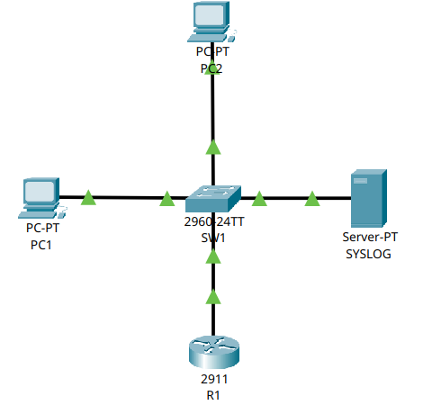
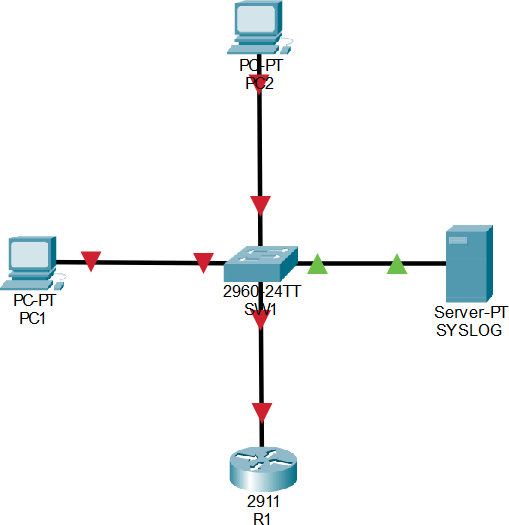
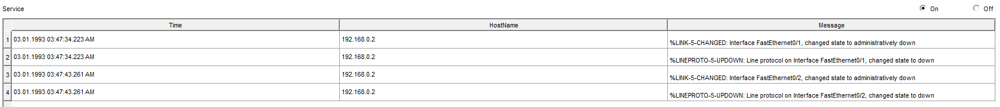
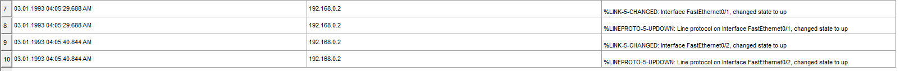

# 🌐 Esercizio 07: Syslog Server
## 🎯 Obiettivo:

Impostare il servizio Syslog su un server
Lo scopo dell'esercizio è: 
- Configurare gli indirizzi IP dei dispositivi
- Configurare il servizio Syslog
- Verificare la tabella del Syslog

## 🖥️ Topologia di rete

Schema della Rete realizzata:



## 🧰 Dispositivi utilizzati
|  Dispositivo  |  Quantità  |
|--|--|
| Cisco Router 2911 | 1 |
| Cisco Catalyst 2960-24TT | 1 |
| PC | 2 |
| Server-PT | 1 |
| Cavi Copper Straight-Through | 4 |

## 📡Configurazione IP
| Dispositivo | Indirizzo IP | Subnet Mask |  Default Gateway |
|---|---|---|---|
| 💻 PC1 | 192.168.0.11 | 255.255.255.0 | 192.168.0.254 |
| 💻 PC2 | 192.168.0.12 | 255.255.255.0 | 192.168.0.254 |
| 🔀 SW1 | 192.168.0.2 | 255.255.255.0 | 192.168.0.254 |
| 🌐 SERVER | 192.168.0.100 | 255.255.255.0 | 192.168.1.254 |

## ⚙️ Configurazione Eseguita

###  💻 Computer

Configurati manualmente:

- Indirizzo IP
- Subnet Mask
- Default Gateway

### 🔀 Switch

Lo switch opera in modalità Layer 2 con configurazione di default (VLAN 1)
E' stato modificato l'hostname con il seguente comando:
```
hostname SW1
```
È stata configurata l'interfaccia virtuale VLAN 1 (SVI) per poter comunicare con il server Syslog, questo è necessario affinché lo switch possa generare traffico IP e comunicare verso il server. Senza un indirizzo IP sulla SVI, lo switch opererebbe esclusivamente a livello 2 e non potrebbe generare traffico IP verso altri dispositivi della rete.
La configurazione è stata effettuata tramite questo comando:
```
int vlan1
ip address 192.168.0.2 255.255.255.0
no shutdown
exit
ip default-gateway 192.168.0.254
logging on ==> abilito il servizio di logging
logging 192.168.0.100 ==> specifico il server a cui mandare i logs
logging trap debugging ==> definisce il livello di gravità dei messaggi di sistema (da 0 a 7, dal più grave al meno grave)
service timestamps log datetime msec
```
**Analisi comando service timestamps log datetime msec:**

--> ```service timestamps``` attiva la marcatura temporale per i servizi di sistema
--> ```log``` specifica che questa regola si applica ai messaggi di log
--> ```datetime``` sostituisce il counter dei minuti/giorni dall'avvio con la data e l'ora reali
--> ```msec``` aggiunge il massimo livello di precisione, mostrando anche i milli-secondi


Questo perché lo switch diventa un client di rete che invia i logs al server.
Solitamente, non si usa mai la vlan1 come default, ma si crea una vlan dedicata per motivi di sicurezza.


### 🖧 Router

Configurazione  dell'interfaccia Gig0/0 tramite i seguenti comandi:

```
conf t
hostname R1
int Gig0/0
ip address 192.168.0.254 255.255.255.0
no shutdown
exit
logging on
logging 192.168.0.100
logging trap debugging
service timestamps log datetime msec
```

## 🛠️ Test Effettuati

Verifica dell'effettivo collegamento dei PC allo Switch tramite il comando:

```
show interfaces status
```
con seguente Output:
```
SW1
Port    Name  Status     Vlan   Duplex    Speed   Type
Fa0/1         connected  1      a-full    a-100   10/100BaseTX
Fa0/2         connected  1      a-full    a-100   10/100BaseTX
Gig0/1        connected  1      a-full    a-100   10/100/1000BaseTX
Gig0/2        connected  1      a-full    a-100   10/100/1000BaseTX
```

Verifica della Switching Table dello Switch utilizzando il comando:

```
show mac address-table
```
con seguente Output:

```
SW1
Vlan    Mac Address       Type        Ports
----    -----------       --------    -----

   1    0001.c762.8201    DYNAMIC     Gig0/2
   1    0001.c96e.41e6    DYNAMIC     Fa0/2
   1    0060.4786.51de    DYNAMIC     Fa0/1
   1    00d0.ff02.e57e    DYNAMIC     Gig0/1
```

Verifica degli indirizzi IP assegnati alle porte del router tramite il comando:
```
show ip interface brief
```

con seguente Output:

```
Interface              IP-Address      OK? Method Status                Protocol 
GigabitEthernet0/1     192.168.0.254   YES manual up                    up 
```

Verifica del funzionamento del server Syslog:
Per verificare il corretto funzionamento del server Syslog, sono stati simulati alcuni eventi che possono verificarsi quotidianamente in una rete aziendale, come la disconnessione di dispositivi o l'indisponibilità di alcune interfacce di rete.

Per prima cosa è stata disabilitata l'interfaccia GigabitEthernet0/0 del router tramite il comando:
```
shutdown
```

Successivamente sono state disabilitate le interfacce FastEthernet0/1 e FastEthernet0/2 dello switch, simulando la perdita di connettività dei due PC collegati:
```
shutdown
```

Il risultato della simulazione è il seguente:



Analizzando i log ricevuti dal server Syslog è possibile osservare quanto segue:



Lo switch ha inviato correttamente al server i messaggi relativi alla disattivazione delle due porte. Al contrario, il router non ha potuto inviare alcun messaggio riguardante la disattivazione della propria interfaccia, poiché proprio quell'interfaccia rappresentava l'unico collegamento disponibile verso il server Syslog. Una volta disabilitata, il router ha perso la connettività IP necessaria per trasmettere ulteriori messaggi di log.

Riabilitando successivamente le porte tramite il comando:
```
no shutdown
```

è possibile osservare che lo switch ha nuovamente inviato al server Syslog i messaggi che segnalano il ripristino delle interfacce:



📌 Osservazione:

Questo test dimostra uno dei limiti del protocollo Syslog: se un dispositivo perde completamente la connettività verso il server, gli eventi successivi non posso essere trasmessi. Per questo motivo, nelle infrastrutture di produzione è buona pratica utilizzare collegamenti rindondanti e sistemi di monitoraggio complementari, in modo da rilevare anche la perdita di connettività dei dispositivi.

❓ Cos'è Syslog?

Syslog, è un protocollo standard utilizzato nei sistemi operativi simili a Unix e nei dispositivi di rete (come router, firewall) per inviare e raccogliere messaggi di log.
Permette di raccogliere log dalla maggior parte dei dispositivi di rete.

❓ Perché viene utilizzato?

Risulta utile per monitorare infrastrutture, fare troubleshooting, auditing, analisi degli incidenti e per la sicurezza informatica.
In reti aziendali con centinaia di dispositivi sarebbe impossibile consultare manualmente i log di ogni apparato. Un server Syslog (detto **collector**) permette di raccogliere tutti gli eventi in un unico punto.

❓ Come funziona? 

Router
      \
       \
Switch ---> Server Syslog
       /
Firewall

In un infrastruttura ci sono i client che generano un messaggio assegnandogli un livello di gravità e successivamente viene spedito al collector, ovvero il server.
Nello specifico funziona così:

1. si verifica un evento;
2. il dispositivo genera un messaggio;
3. assegna un livello di gravità;
4. invia il log al server;
5. il server lo archivia;

❓ Quali sono i livelli di gravità?

I livelli di gravità syslog (standard RFC 5424) sono classificati su una scala da 0 a 7, dove 0 indica l'emergenza più grave e 7 i dettagli del debug.

| Livello | Nome
|--|--|
| 0 | Emergency |
| 1 | Alert |
| 2 | Critical |
| 3 | Error |
| 4 | Warning |
| 5 | Notification |
| 6 | International |
| 7 | Debugging |

Nel caso dell'esercizio, è stato scelto il livello 7, che implementa informazioni dettagliate per la risoluzione dei problemi.

❓ Quale protocollo e porta utilizza?

Syslog utilizza di default il protocollo UDP porta 514.


# 🛠️ Problemi riscontrati

