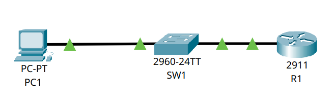

# 🌐 Esercizio 08: Password e Banner di sicurezza
## 🎯 Obiettivo:

Impostare il su switch e router password e banner.
Lo scopo dell'esercizio è: 
- Configurare gli indirizzi IP dei dispositivi
- Configurare una sicurezza base su switch e router
- Verificare la sicurezza configurata

## 🖥️ Topologia di rete

Schema della Rete realizzata:



## 🧰 Dispositivi utilizzati
|  Dispositivo  |  Quantità  |
|--|--|
| Cisco Router 2911 | 1 |
| Cisco Catalyst 2960-24TT | 1 |
| PC | 1 |
| Cavi Copper Straight-Through | 3 |

## 📡Configurazione IP
| Dispositivo | Indirizzo IP | Subnet Mask |  Default Gateway |
|---|---|---|---|
| 💻 PC1 | 192.168.0.11 | 255.255.255.0 | 192.168.0.254 |
| 🔀 SW1 | 192.168.0.2 | 255.255.255.0 | 192.168.0.254 |

## ⚙️ Configurazione Eseguita

###  💻 Computer

Configurati manualmente:

- Indirizzo IP
- Subnet Mask
- Default Gateway

### 🔀 Switch

Lo switch opera in modalità Layer 2 con configurazione di default (VLAN 1)
E' stato modificato l'hostname con il seguente comando:
```
hostname SW1
```
È stata configurata l'interfaccia virtuale VLAN 1 (SVI) per poterci collegare tramite protocollo SSH. Senza un indirizzo IP sulla SVI, lo switch opererebbe esclusivamente a livello 2 e non potrebbe generare traffico IP verso altri dispositivi della rete.
La configurazione è stata effettuata tramite questo comando:
```
int vlan1
ip address 192.168.0.2 255.255.255.0
no shutdown
exit
ip default-gateway 192.168.0.254
```
Configurazione degli accessi e banner tramite:

```
conf t
enable secret Cisco123!
service password-encryption
banner motd #ATTENZIONE! Accessi consentito solo al personale autorizzato.#
line console 0
password Console123!
login
exit
ip domain-name test.local
ip ssh version 2
username admin secret SshPass123!
crypto key generate rsa [2048]
line vty 0 4
transport input ssh
login local
```

Solitamente, non si usa mai la vlan1 come default, ma si crea una vlan dedicata per motivi di sicurezza.

Spiegazione comandi:

--> ```service password-encryption``` permette di cifrare le password nel file di configurazione
--> ```banner motd``` permette di inserire un banner che viene visualizzato durante la connessione ad un device

📌 Differenza tra ```enable password``` e ```enable secret```

Utilizzando ```enable password```, le password non vengono cifrate. Diversamente usando ```enable secret``` vengono cifrate.


### 🖧 Router

Configurazione  dell'interfaccia Gig0/0 tramite i seguenti comandi:

```
conf t
hostname R1
int Gig0/0
ip address 192.168.0.254 255.255.255.0
no shutdown
exit
```

Configurazione degli accessi e banner tramite:

```
conf t
enable secret Cisco123!
service password-encryption
banner motd #ATTENZIONE! Accessi consentito solo al personale autorizzato.#
line console 0
password Console123!
login
exit
ip domain-name test.local
ip ssh version 2
username admin secret SshPass123!
crypto key generate rsa [2048]
line vty 0 4
transport input ssh
login local
```


## 🛠️ Test Effettuati